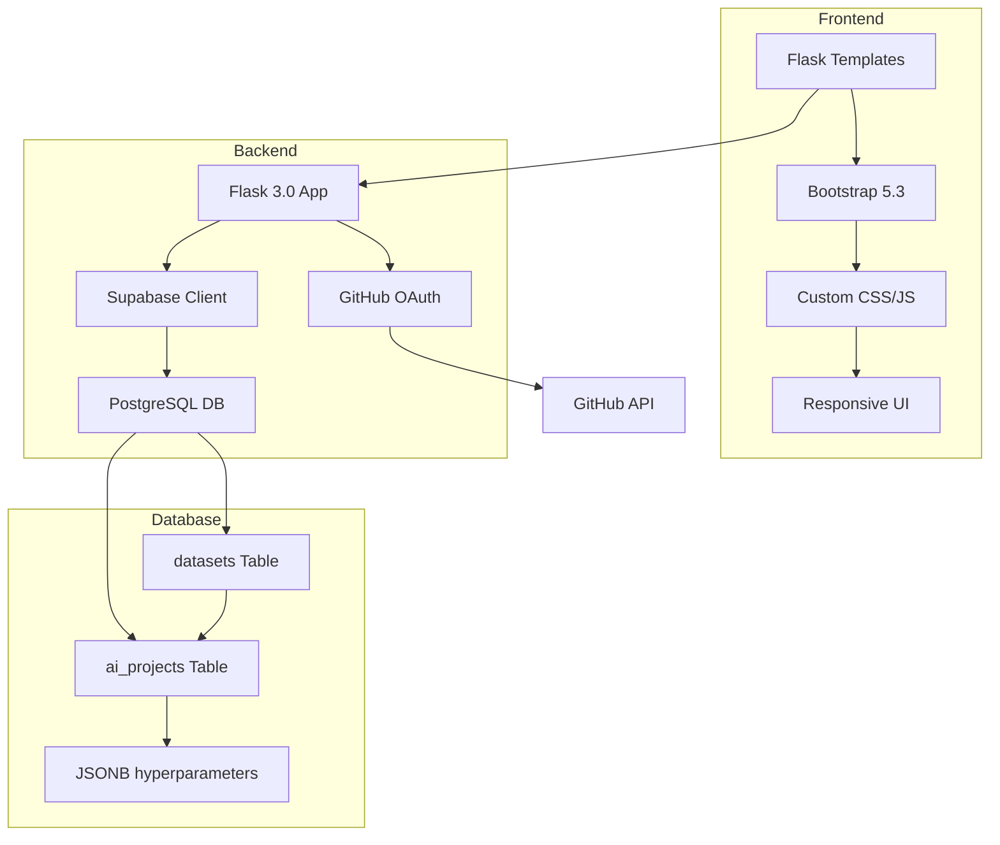

# Supabase-Experiments

[](https://python.org)
[](https://flask.pallets.com)
[](https://supabase.com)
[](https://getbootstrap.com)

> 🚀 **Modern web application for managing AI projects and datasets with Supabase integration**

A comprehensive Flask web application demonstrating modern full-stack development with Supabase backend, featuring GitHub OAuth authentication, responsive UI, and advanced data management capabilities for AI/ML projects.

## 📋 Table of Contents

- [Features](#-features)
- [Architecture](#-architecture)
- [Installation](#-installation)
- [Configuration](#-configuration)
- [Usage](#-usage)
- [Project Structure](#-project-structure)
- [API Endpoints](#-api-endpoints)
- [Screenshots](#-screenshots)
- [Demonstrated Concepts](#-demonstrated-concepts)

## ✨ Features

### 🎯 Core Features
- 🔐 **GitHub OAuth Authentication** - Secure login with GitHub integration
- 🎨 **Modern UI/UX** - Responsive design with cosmic dark theme and glassmorphism effects
- 📊 **Interactive Dashboard** - Real-time statistics and project overview
- 🤖 **AI Project Management** - Create, edit, and manage ML projects with JSONB hyperparameters
- 📚 **Dataset Management** - Link datasets to projects with metadata tracking
- 🔄 **Real-time Updates** - Dynamic content loading and form validation

### 🎁 Advanced Features
- ✨ **Progressive Web App** - Modern web technologies and responsive design
- 📱 **Mobile Responsive** - Optimized for all screen sizes
- 🎭 **Advanced Animations** - Smooth transitions and loading states
- 🌙 **Dark Theme** - Professional cosmic-inspired design system
- 📈 **Advanced Analytics** - Comprehensive statistics and data visualization
- 🔍 **Smart Search & Filter** - Enhanced data discovery capabilities

## 🏗️ Architecture



**Technology Stack:**
- **Frontend**: HTML5, CSS3, JavaScript, Bootstrap 5.3
- **Backend**: Flask 3.0, Python 3.8+
- **Database**: Supabase (PostgreSQL + REST API)
- **Authentication**: GitHub OAuth 2.0
- **Styling**: Custom CSS with glassmorphism and cosmic theme
- **Icons**: Font Awesome 6.0

## 🔧 Installation

1. **Clone the repository**
```bash
git clone https://github.com/TonyVallad/Supabase-Experiments.git
cd Supabase-Experiments
```

2. **Create and activate virtual environment**
```bash
python -m venv .venv
.venv\Scripts\activate  # Windows
# or
source .venv/bin/activate  # Linux/Mac
```

3. **Install dependencies**
```bash
pip install -r requirements.txt
# or manually:
pip install flask supabase python-dotenv requests
```

## ⚙️ Configuration

### 1. Supabase Setup

1. Create a new project on [supabase.com](https://supabase.com)
2. In the **SQL Editor**, execute:

```sql
-- AI projects table
CREATE TABLE ai_projects (
  id UUID PRIMARY KEY DEFAULT gen_random_uuid(),
  name VARCHAR(255) NOT NULL,
  description TEXT,
  model_type VARCHAR(100),
  hyperparameters JSONB,
  created_at TIMESTAMP DEFAULT NOW(),
  user_id VARCHAR(255) -- For user isolation
);

-- Datasets table
CREATE TABLE datasets (
  id UUID PRIMARY KEY DEFAULT gen_random_uuid(),
  name VARCHAR(255) NOT NULL,
  description TEXT,
  size_mb INTEGER,
  format VARCHAR(50),
  source_url TEXT,
  ai_project_id UUID REFERENCES ai_projects(id),
  created_at TIMESTAMP DEFAULT NOW(),
  user_id VARCHAR(255)
);
```

3. **Enable GitHub OAuth** in Authentication > Providers

### 2. GitHub OAuth App

1. Go to GitHub Settings > Developer settings > OAuth Apps
2. Create a new OAuth App with:
   - **Application name**: Supabase-Experiments
   - **Homepage URL**: `http://localhost:5000`
   - **Authorization callback URL**: `https://your-project.supabase.co/auth/v1/callback`

### 3. Environment Variables

Create a `.env` file:

```env
SUPABASE_URL=https://your-project.supabase.co
SUPABASE_KEY=your-public-anon-key
FLASK_SECRET_KEY=your-secret-key-here
FLASK_DEBUG=True
```

## 🚀 Usage

### Running the Application

```bash
python app.py
```

Then visit: `http://localhost:5000`

### Main Features

1. **Authentication**: Click "Login with GitHub" to authenticate
2. **Dashboard**: View project statistics and quick actions
3. **AI Projects**: Create, edit, and manage ML projects
4. **Datasets**: Link datasets to projects with metadata
5. **Analytics**: View comprehensive statistics and insights

## 📁 Project Structure

```
Supabase-Experiments/
├── 📄 app.py                       # Main Flask application
├── 📄 config.py                    # Application configuration
├── 📄 main_exercice.py             # Original CLI version
├── 📄 requirements.txt             # Python dependencies
├── 📄 setup.py                     # Package setup configuration
├── 📄 .env                         # Environment variables
├── 📄 .gitignore                   # Git ignore rules
├── 📁 templates/                   # Jinja2 templates
│   ├── 📄 base.html               # Base template with navigation
│   ├── 📄 index.html              # Dashboard page
│   ├── 📄 login.html              # Authentication page
│   ├── 📄 projects.html           # AI projects management
│   ├── 📄 datasets.html           # Dataset management
│   └── 📄 auth_callback.html      # OAuth callback handler
├── 📁 static/                      # Static assets
│   ├── 📁 css/
│   │   └── 📄 style.css           # Custom styling (cosmic theme)
│   ├── 📁 js/
│   │   └── 📄 main.js             # JavaScript functionality
│   └── � images/                 # Image assets
├── 📁 docs/                       # Documentation
└── 📄 README.md                   # This file
```

## 🔌 API Endpoints

### Authentication
- `GET /` - Dashboard (requires auth)
- `GET /login` - Login page
- `GET /auth/callback` - OAuth callback
- `POST /logout` - User logout

### AI Projects
- `GET /projects` - Projects management page
- `GET /api/projects` - List all projects (JSON)
- `POST /api/projects` - Create new project
- `PUT /api/projects/<id>` - Update project
- `DELETE /api/projects/<id>` - Delete project

### Datasets
- `GET /datasets` - Datasets management page
- `GET /api/datasets` - List all datasets (JSON)
- `POST /api/datasets` - Create new dataset
- `PUT /api/datasets/<id>` - Update dataset
- `DELETE /api/datasets/<id>` - Delete dataset

## � Screenshots

### Dashboard
![Dashboard with statistics and project overview]

### AI Projects Management
![Projects page with create/edit functionality]

### Dataset Management
![Datasets linked to AI projects]

### Responsive Design
![Mobile-optimized interface]

## 🧠 Demonstrated Concepts

| Concept | Implementation | Description |
|---------|----------------|-------------|
| **Full-Stack Development** | Flask + Supabase + Frontend | Complete web application |
| **OAuth Authentication** | GitHub OAuth 2.0 | Secure user authentication |
| **Responsive Design** | Bootstrap 5.3 + Custom CSS | Mobile-first approach |
| **Modern UI/UX** | Glassmorphism + Dark theme | Professional design system |
| **REST API** | Flask routes + JSON responses | RESTful web services |
| **Database Relations** | PostgreSQL + Foreign keys | Relational data modeling |
| **JSONB Storage** | Flexible hyperparameters | Semi-structured data |
| **Error Handling** | Try/catch + User feedback | Robust error management |
| **Progressive Enhancement** | JavaScript + AJAX | Modern web interactions |

## 🎨 Design Features

- **Cosmic Dark Theme**: Professional dark color scheme
- **Glassmorphism Effects**: Modern translucent design elements
- **Responsive Layout**: Mobile-first responsive design
- **Smooth Animations**: CSS transitions and loading states
- **Interactive Components**: Modals, dropdowns, and forms
- **Accessibility**: Semantic HTML and ARIA labels

## 📚 Learning & Reference

This project serves as a learning resource and technical demonstration. Feel free to:

- **Study the code** to understand Flask + Supabase integration patterns
- **Fork the repository** for your own learning and experimentation
- **Use it as a reference** for building similar applications
- **Adapt the concepts** to your own projects

The codebase demonstrates best practices for modern web development with Python and showcases practical implementation of authentication, database integration, and responsive UI design.

## 📝 License

This project is licensed under the MIT License - see the [LICENSE](LICENSE) file for details.

## 🔗 Useful Links

- [Flask Documentation](https://flask.palletsprojects.com/)
- [Supabase Documentation](https://supabase.com/docs)
- [Bootstrap 5.3](https://getbootstrap.com/docs/5.3/)
- [GitHub OAuth Apps](https://docs.github.com/en/developers/apps)

---

⭐ **If this project helped you, please give it a star!**