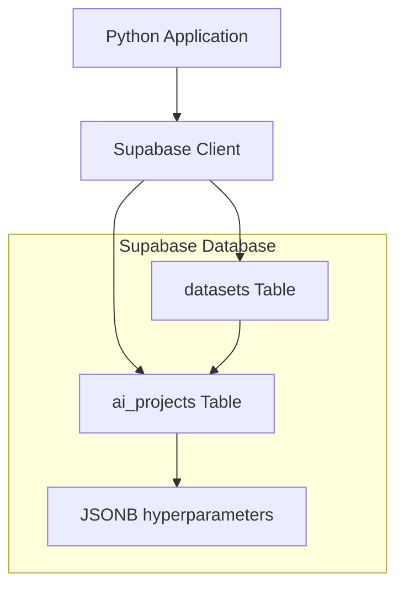

# Supabase-Experiments

[](https://python.org)
[](https://supabase.com)

> 🚀 **Python mini-application connected to Supabase for managing AI projects and their datasets**

This repository contains the complete implementation of a practical exercise demonstrating integration between Python and Supabase, with a focus on managing Artificial Intelligence projects and their associated data.

## 📋 Table of Contents

- [Features](#-features)
- [Architecture](#-architecture)
- [Installation](#-installation)
- [Configuration](#-configuration)
- [Usage](#-usage)
- [Project Structure](#-project-structure)
- [Demonstrated Concepts](#-demonstrated-concepts)
- [Execution Example](#-execution-example)

## ✨ Features

### 🎯 Core Features
- ✅ **AI project creation** with flexible JSONB hyperparameters
- ✅ **Reading and displaying** all projects with statistics
- ✅ **Robust error handling** with clear user messages

### 🎁 Bonus Features
- ✅ **Dataset management** linked to AI projects
- ✅ **SQL relations** with foreign keys and constraints
- ✅ **Advanced statistics**: total size, formats, aggregations
- ✅ **JOIN queries** for relational data

## 🏗️ Architecture



**Technologies used:**
- **Backend**: Supabase (PostgreSQL + REST API)
- **Language**: Python 3.8+
- **Libraries**: supabase-py, python-dotenv
- **Database**: PostgreSQL with JSONB

## 🔧 Installation

1. **Clone the repository**
```bash
git clone https://github.com/TonyVallad/Supabase-Experiments.git
cd Supabase-Experiments
```

2. **Create a virtual environment**
```bash
python -m venv venv
venv\Scripts\activate  # Windows
# or
source venv/bin/activate  # Linux/Mac
```

3. **Install dependencies**
```bash
pip install supabase python-dotenv
```

## ⚙️ Configuration

### 1. Supabase Project

1. Create a new project on [supabase.com](https://supabase.com)
2. In the **Table Editor**, execute the following SQL:

```sql
-- Main AI projects table
CREATE TABLE ai_projects (
  id UUID PRIMARY KEY DEFAULT gen_random_uuid(),
  name VARCHAR(255) NOT NULL,
  description TEXT,
  model_type VARCHAR(100),
  hyperparameters JSONB,
  created_at TIMESTAMP DEFAULT NOW()
);
```

3. **For bonus features**, also execute:
```bash
# Content of datasets_table.sql file
```

### 2. Environment Variables

Create a `.env` file at the project root:

```env
SUPABASE_URL=https://your-project.supabase.co
SUPABASE_KEY=your-public-anon-key
```

> 💡 **Get your keys**: Project Settings > API in your Supabase dashboard

## 🚀 Usage

### Running the application

```bash
python main_exercice.py
```

### Main Functions

- **`create_ai_project()`**: Create a new AI project
- **`list_projects()`**: Display all projects
- **`create_dataset()`**: Add a dataset to a project
- **`datasets_statistics()`**: Calculate global metrics

## 📁 Project Structure

```
Supabase-Experiments/
├── 📄 main_exercice.py              # Main application
├── 📄 datasets_table.sql            # SQL script for datasets table
├── 📄 .env                          # Environment variables (to create)
├── 📄 README.md                     # This file
├── 📄 LICENSE                       # Project license
├── 📄 IMPLEMENTATION_COMPLETE.md    # Detailed technical documentation
└── 📁 docs/
    ├── 📄 Exercice_pratique_Supabase+Python.md     # Exercise instructions
    └── 📄 Exercice_pratique_Supabase+Python.pdf
```

## 🧠 Demonstrated Concepts

| Concept | Description | Implementation |
|---------|-------------|----------------|
| **JSONB** | Flexible storage of semi-structured data | AI model hyperparameters |
| **CRUD Operations** | Create, Read, Update, Delete | AI projects and datasets |
| **SQL Relations** | Foreign keys and joins | Projects ↔ datasets linking |
| **Error Handling** | Try/catch and user messages | All functions |
| **REST API** | Interaction with Supabase via HTTP | Python supabase-py client |

## 📊 Execution Example

```
🚀 Starting Supabase + Python application
============================================================

📝 Creating AI projects...
✅ AI project 'Spam Detection' created successfully!
✅ AI project 'Facial Recognition' created successfully!
✅ AI project 'Weather Prediction' created successfully!

📊 List of AI projects:
==================================================
Name: Spam Detection | Type: NLP
Name: Facial Recognition | Type: Computer Vision
Name: Weather Prediction | Type: Time Series
--------------------------------------------------
Total number of projects: 3

🎁 BONUS: Dataset Management
============================================================

📋 Creating datasets...
✅ Dataset 'Enron Email Dataset' created successfully!
✅ Dataset 'ImageNet Faces' created successfully!
✅ Dataset 'Historical Weather Data' created successfully!

📊 Dataset statistics:
============================================================
• Enron Email Dataset (450 MB) - Format: CSV
  ↳ Project: Spam Detection
• ImageNet Faces (2048 MB) - Format: JPG
  ↳ Project: Facial Recognition
• Historical Weather Data (320 MB) - Format: JSON
  ↳ Project: Weather Prediction
------------------------------------------------------------
📈 Total dataset size: 2818 MB (2.8 GB)
📁 Total number of datasets: 3
📄 Formats used: CSV, JPG, JSON
```

## 🤝 Contributing

Contributions are welcome! Feel free to:

1. Fork the project
2. Create a feature branch (`git checkout -b feature/amazing-feature`)
3. Commit your changes (`git commit -m 'Add amazing feature'`)
4. Push to the branch (`git push origin feature/amazing-feature`)
5. Open a Pull Request

## 📝 License

This project is licensed under the MIT License - see the [LICENSE](LICENSE) file for details.

## 🔗 Useful Links

- [Supabase Documentation](https://supabase.com/docs)
- [Supabase Python Client](https://github.com/supabase/supabase-py)
- [PostgreSQL JSONB](https://www.postgresql.org/docs/current/datatype-json.html)

---

⭐ **If this project was useful to you, don't hesitate to give it a star!**